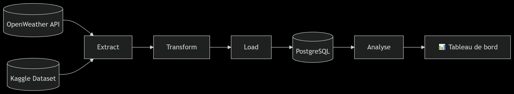
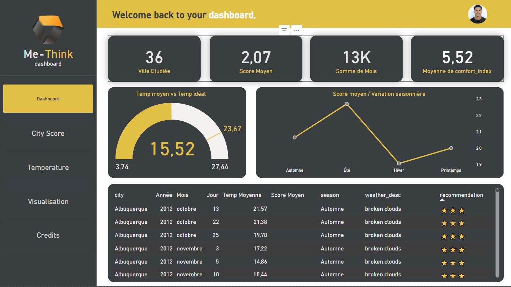
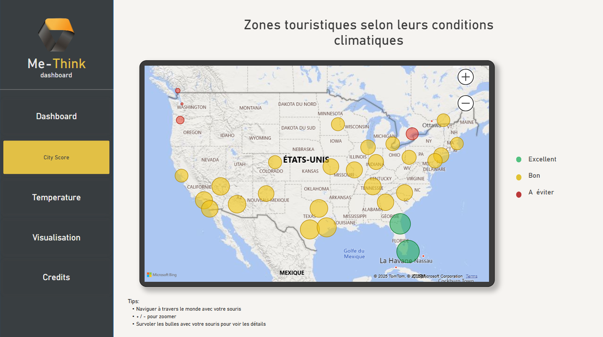
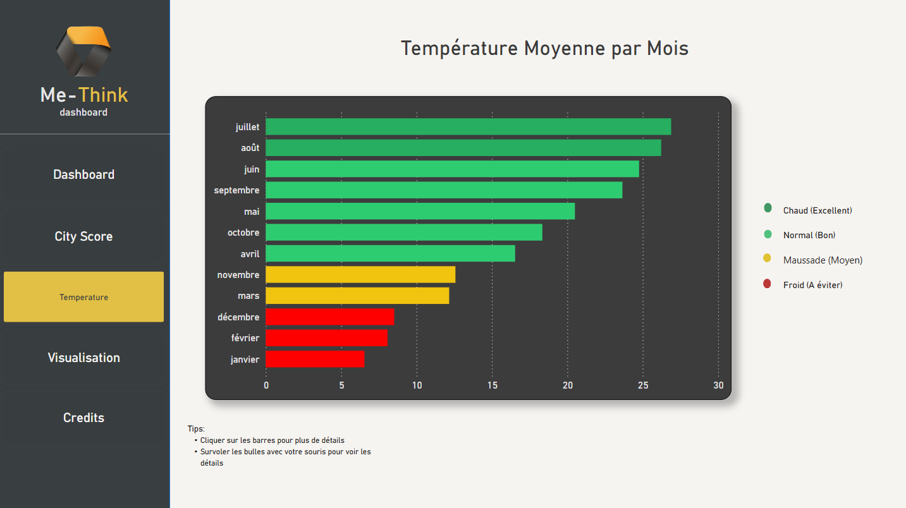
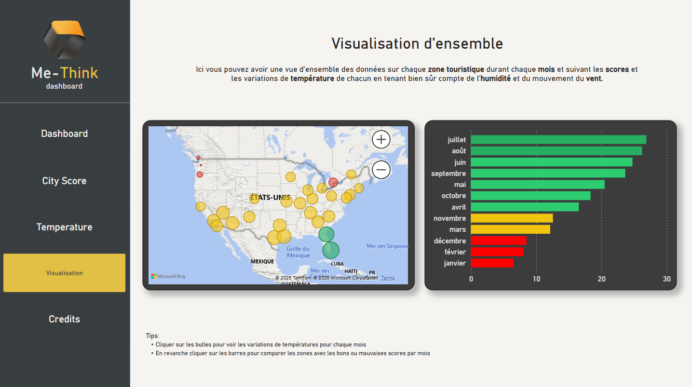

# 🌦️ Weather Tourism Analytics Pipeline


## 📌 Contexte du Projet

Ce projet transforme des données météorologiques en recommandations touristiques actionnables. 

**Problématique** :  
Les acteurs du tourisme manquent d'outils data-driven pour évaluer l'impact des conditions climatiques sur l'expérience touristique.

**Solution** :  
Un pipeline ETL qui :
1. **Collecte** des données météo en temps réel et historiques
2. **Calcule** des indicateurs touristiques
3. **Génère** des recommandations personnalisées

## 🏗️ Structure du Projet

```bash
dags
|   └── weather_dags/               # Pipeline Airflow
weather_pipeline/
├── config/
│   └── settings.py                 # Configuration centrale
├── data/
│   ├── historical/                 # Données brutes Kaggle
│   ├── processed/                  # Données transformées
│   ├── raw/                        # Données API brutes
│   └── reports/                    # Rapports finaux
├── docs/                           # Documentation technique
├── notebooks/                      # Analyses exploratoires
└── scripts/
    └── etl/                        # Scripts ETL
```
## 🔄 Workflow Data



## 🛠️ Fonctionnement des Composants (ETL)

**1. Collete de Données (extract)**

| Script | Fonction | Sortie |
|---------|---------|-------------|
| openweather.py | Récupère les données temps réel | fetch_weather_data(["Paris", "Lyon"], "data/raw") |
| historical_transformer.py | Prépare les données historiques	 | transform_historical_data("data/historical") |

**2. Transformation (transform)**

| Fichier | Techno | Sortie |
|---------|---------|-------------|
| transformer.py | Pandas, NumPy | data/processed/weather_processed.csv |
| tourism_metrics.py | Scikit-learn	 | data/reports/tourism_scores.csv |

**3. Charlgement (load)**

| Script | BD | Méthode |
|---------|---------|-------------|
| loader.py | PostgreSQL | Upsert |
| historical_loader.py | PostgreSQL	 | Bulk insert |

## 📊 Notebooks d'Analyse (EDA)

```bash
notebooks/
├── 1_EDA_Weather.ipynb          # Analyse des données météo brutes
├── 2_EDA_Tourism.ipynb       # Analyse des scores touristiques
└── 3_EDA_Combined.ipynb       # Analyse croisée météo-tourisme
```

## 📊 Dashboard interactive (Power BI)






