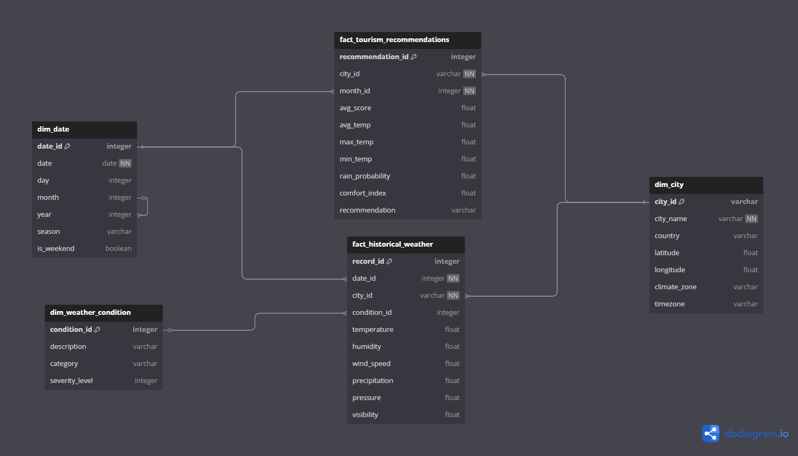

# Modèle de Données - Pipeline Météo & Tourisme

## Schéma Conceptuel


## Structure du Modèle

### Modèle en Étoile
Votre modèle suit une **architecture en étoile** avec :

- **3 tables de dimensions** :
  - `dim_date`
  - `dim_city` 
  - `dim_weather_condition`

- **2 tables de faits** :
  - `fact_historical_weather`
  - `fact_tourism_recommendations`

## Tables de Dimensions

### 📅 Table `dim_date`

**Objectif** : Standardiser l'analyse temporelle

| Champ         | Type      | Description |
|---------------|-----------|-------------|
| `date_id`     | INTEGER   | PK          |
| `season`      | VARCHAR   | Saison climatique |
| `is_weekend`  | BOOLEAN   | Jour de weekend |

**Justification** :
> "Cette table permet des analyses temporelles complexes sans duplication des données de date dans chaque enregistrement."

---

### 🏙️ Table `dim_city`

**Objectif** : Centraliser les informations géographiques

| Champ          | Type    | Description |
|----------------|---------|-------------|
| `city_id`      | VARCHAR | PK          |
| `climate_zone` | VARCHAR | Zone climatique |
| `timezone`     | VARCHAR | Fuseau horaire |

**Justification** :
> "La séparation des attributs géographiques permet des mises à jour centralisées et évite la redondance."

---

### 🌦️ Table `dim_weather_condition`

**Objectif** : Classifier les conditions météo

| Champ            | Type    | Description |
|------------------|---------|-------------|
| `condition_id`   | INTEGER | PK          |
| `category`       | VARCHAR | Type de temps |
| `severity_level` | INTEGER | Niveau de sévérité |

## Tables de Faits

### 📊 Table `fact_historical_weather`

**Objectif** : Stocker les observations météorologiques

| Champ           | Type    | Description |
|-----------------|---------|-------------|
| `record_id`     | INTEGER | PK          |
| `temperature`   | FLOAT   | Température |
| `humidity`      | FLOAT   | Humidité    |

**Relations** :
- `date_id` → `dim_date`
- `city_id` → `dim_city`
- `condition_id` → `dim_weather_condition`

---

### ⭐ Table `fact_tourism_recommendations`

**Objectif** : Stocker les recommandations touristiques

| Champ               | Type    | Description |
|---------------------|---------|-------------|
| `recommendation_id` | INTEGER | PK          |
| `avg_score`         | FLOAT   | Score moyen |
| `recommendation`    | VARCHAR | Conseils    |

**Relations** :
- `city_id` → `dim_city`
- `month_id` → `dim_date`

## Justifications Techniques

### Pourquoi ce modèle ?

1. **Performance** :
   - Optimisé pour les requêtes analytiques
   - Jointures rapides sur clés entières

2. **Flexibilité** :
   - Ajout facile de nouvelles dimensions
   - Évolutivité horizontale

3. **Compatibilité** :
   - Structure reconnue par les outils BI
   - Adapté aux besoins métier

## Exemple d'Utilisation

```sql
-- Top 5 des villes les plus agréables en été
SELECT 
    c.city_name,
    AVG(r.avg_score) as avg_summer_score
FROM fact_tourism_recommendations r
JOIN dim_city c ON r.city_id = c.city_id
JOIN dim_date d ON r.month_id = d.date_id
WHERE d.season = 'Été'
GROUP BY c.city_name
ORDER BY avg_summer_score DESC
LIMIT 5;